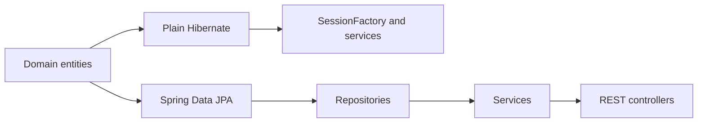

# Hibernate and Spring Data JPA Classroom Examples


Two small Java 21 examples that demonstrate the same author-and-book domain
with plain Hibernate and with Spring Boot, Spring Data JPA, validation, and a
REST API.

This repository is intended for classroom use: start with explicit Hibernate
session management, then compare it with the repository/service/controller
structure provided by Spring.

## What is included

| Module | Purpose |
|---|---|
| [`hibernate/`](hibernate/) | Plain Hibernate 6 example using `SessionFactory`, mapped entities, and service classes |
| [`hiberanat and spring/`](hiberanat%20and%20spring/) | Spring Boot 3.4 example using Spring Data JPA, REST controllers, validation, and exception handling |

Both modules model:

- `Author`, `Book`, and `Category` entities
- Author/book relationships
- Repository and service operations
- MySQL persistence

The Spring module additionally exposes CRUD and search operations over HTTP.

## Learning path



Suggested order:

1. Inspect the entities in the plain Hibernate module.
2. Follow `SFUtil` and the service implementations to see explicit session
   management.
3. Compare those services with the Spring Data repositories.
4. Call the Spring REST endpoints and observe validation and exception
   handling.

## Prerequisites

- JDK 21
- Maven 3.9+
- MySQL 8

> The projects target Java 21. Newer, non-LTS JDKs may not be compatible with
> the Lombok version used by these classroom examples.

## Database setup

Create a local database:

```sql
CREATE DATABASE test;
```

Before running either module, replace the example local credentials in:

- `hibernate/src/main/resources/hibernate.cfg.xml`
- `hiberanat and spring/src/main/resources/application.properties`

Never reuse development credentials in a shared or production environment.

## Run the plain Hibernate example

```bash
cd hibernate
mvn package
```

Run `com.fanap.Main` from your IDE to execute the sample service query.

## Run the Spring Boot example

```bash
cd "hiberanat and spring"
mvn spring-boot:run
```

The application listens on `http://localhost:8888`.

## REST API

| Method | Path | Purpose |
|---|---|---|
| `GET` | `/authors` | List authors |
| `GET` | `/authors/{id}` | Find an author by ID |
| `GET` | `/authors/search/{firstName}` | Search authors by first name |
| `GET` | `/authors/firstName/{firstName}` | Find authors by first name |
| `GET` | `/authors/lastName/{lastName}` | Find authors by last name |
| `POST` | `/authors` | Create an author |
| `PUT` | `/authors/{id}` | Update an author |
| `DELETE` | `/authors/{id}` | Delete an author |
| `POST` | `/authors/{id}` | Add a book to an author |

Example:

```bash
curl http://localhost:8888/authors
```

## Project status

This is an educational repository, not a production starter. It intentionally
keeps configuration and application structure compact so the persistence
concepts remain visible. Production systems should add migrations, secret
management, containerized dependencies, broader tests, and API documentation.
